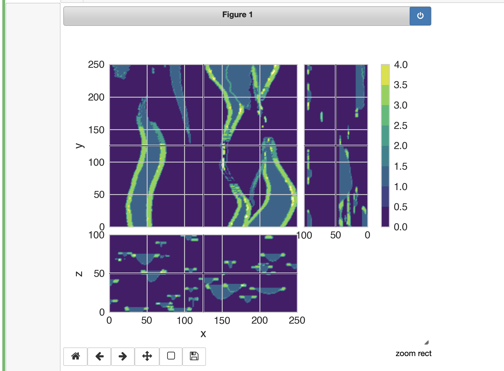

# PyVista + Matplotlib Slicer

This is a hacked version of [@prisae](https://github.com/prisae)'s 3D
[slicer](https://github.com/simpeg/discretize/blob/master/discretize/View.py#L1183)
in [`discretize`](https://github.com/simpeg/discretize) to interactive slice
any 3D [PyVista](http://docs.pyvista.org) mesh using Matplotlib.

This is super hacky and a work in progress. Use with caution.

```py
%matplotlib notebook
import pyvista as pv
from pyvista import examples

# Local import
from slicer import Slicer

mesh = examples.load_channels()

Slicer(mesh, "facies")
```


